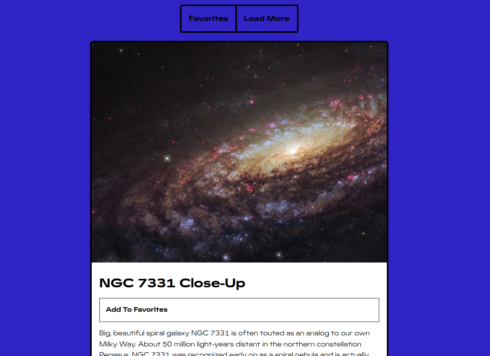

# NASA APOD

- Uses NASA API to get random astronomy pictures of the day
- Formatted into cards. Each card has Image, Title, Add to Favorites, Description, Date and Copyright Info
- View full resolution of image in new tab
- Add Image to Favorites using Local Storage
- Favorites Page
- Load More Images - loads 10 fresh images.
- Images are lazy loaded. Load images only when close to being scrolled to.
- Mobile Responsive UI
- Loading Animation using Loaf (https://getloaf.io/)

Live - https://overdrivemachines.github.io/nasa-apod/

## References
